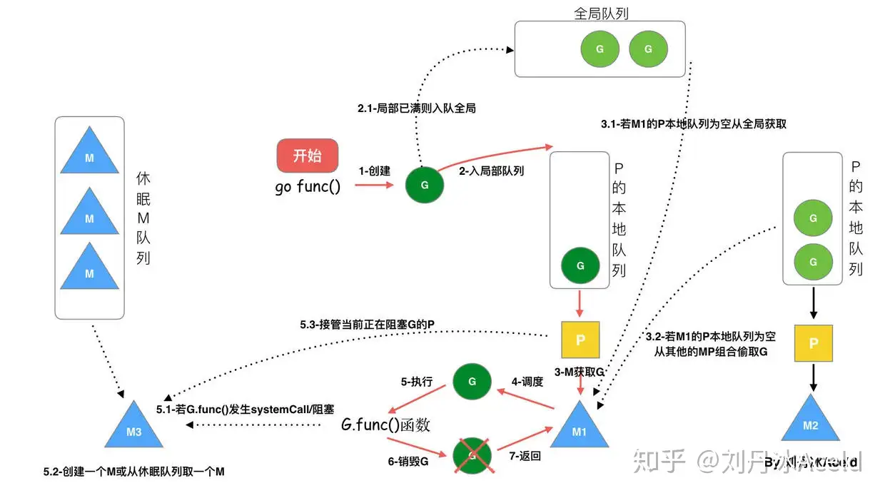

[[Go三关-典藏版\]Golang调度器GPM原理与调度全分析 - 知乎 (zhihu.com)](https://zhuanlan.zhihu.com/p/323271088)

Go 语言的并发模型基于 Goroutine，而在操作系统的层面上，Go 通过一个称为 **GMP 模型** 的调度器来管理 Goroutine 的执行。这套模型的核心是通过调度器高效地将 Goroutine 映射到操作系统线程，从而实现轻量级并发执行。理解 GMP 模型的工作原理需要从 Goroutine、调度器和操作系统线程这三个关键组成部分来分析。

### GMP 模型的基本概念

GMP 模型中的 **G**、**M** 和 **P** 分别代表：
- **G (Goroutine)**：Go 语言中的轻量级线程，是一个执行单元，它包含需要执行的函数、栈空间、任务状态等。每个 Goroutine 由 Go 调度器管理，不直接映射到操作系统的线程。
- **M (Machine)**：代表操作系统的线程。M 执行具体的 Goroutine，是 Go 调度器的实际执行者。M 是映射到操作系统的线程的实体。
- **P (Processor)**：代表 Goroutine 的上下文环境。P 是一种逻辑处理器，管理着执行 Goroutine 所需的资源。每个 P 维护一个 Goroutine 队列，当 M 执行 Goroutine 时，M 必须获取一个 P。

### GMP 并发模型的工作流程



在 GMP 模型中，Go 调度器通过将 **Goroutine (G)** 映射到 **操作系统线程 (M)**，并通过**逻辑处理器 (P)** 进行调度，来实现 Goroutine 的并发执行。下图概述了 GMP 模型中的关系：

```
        +---- G ----+       +---- G ----+       +---- G ----+
        |           |       |           |       |           |
        +-----------+       +-----------+       +-----------+
             |                   |                   |
        +----+----+         +----+----+         +----+----+
        |    P    |         |    P    |         |    P    |
        +----+----+         +----+----+         +----+----+
             |                   |                   |
        +----+----+         +----+----+         +----+----+
        |    M    |         |    M    |         |    M    |
        +----+----+         +----+----+         +----+----+
             |                   |                   |
   +---------+---------+ +--------+--------+ +--------+--------+
   |  操作系统线程 (M)  | |  操作系统线程 (M)  | |  操作系统线程 (M)  |
   +-------------------+ +-------------------+ +-------------------+
```

- **Goroutine (G)**：执行单元。Go 程序中的每个并发任务都运行在一个 Goroutine 中。
- **Processor (P)**：调度器中的核心概念，P 控制 Goroutine 的执行，管理 Goroutine 队列、调度 Goroutine，并与 M 绑定运行。P 的数量决定了同时可以并发执行的 Goroutine 的数量，通常与 CPU 核心数相关。
- **Machine (M)**：操作系统的线程，M 执行从 P 获取到的 Goroutine。M 线程是实际的执行者，将 Goroutine 映射到 CPU 进行处理。

---

### GMP 模型的工作原理

1. **P 的数量（逻辑处理器）**：
   - P（Processor）控制了 Goroutine 的并发执行数量。在 Go 中，P 的数量由 `GOMAXPROCS` 环境变量决定。`GOMAXPROCS` 的默认值是机器的 CPU 核心数，这意味着默认情况下，Go 调度器会启动与 CPU 核心数相等的 P，用于并发执行 Goroutine。

2. **Goroutine 的调度**：
   - 每个 P 维护一个 Goroutine 队列。当 M 线程需要执行 Goroutine 时，它从 P 关联的 Goroutine 队列中取出一个 Goroutine 并执行。当 Goroutine 执行完毕或被挂起时，M 会继续从 P 关联的队列中获取新的 Goroutine 进行执行。
   - 如果 P 关联的 Goroutine 队列为空，P 可以从其他 P 的队列中窃取 Goroutine 以保持工作负载均衡。

3. **M 的绑定和执行**：
   - 每个 M 必须绑定一个 P 才能执行 Goroutine。M 实际上是操作系统的线程，而 Goroutine 本身并不会直接映射到操作系统线程，而是通过 M 来执行。
   - 当 Goroutine 发起阻塞操作（如 I/O 或系统调用）时，M 会进入等待状态，P 可以转移到其他 M 上继续执行其他 Goroutine，避免因为阻塞操作而浪费 CPU 资源。

4. **阻塞处理**：
   - 当 Goroutine 执行阻塞操作时（如 I/O 操作、网络请求等），Go 调度器会将这个 M 从 P 中分离出来，以便 P 能调度其他 Goroutine 到新的 M 上继续运行。这个 M 在等待操作完成后，可能会被重新分配 P 继续执行其他任务。
   - Go 通过这种机制实现了 Goroutine 的高效调度，避免了因为阻塞操作而浪费 CPU 资源。

5. **Goroutine 的抢占**：
   - Go 运行时支持抢占式调度，这意味着 Goroutine 不需要主动让出 CPU 时间片。当 Goroutine 长时间占用 CPU，Go 调度器会强制中断并将 CPU 分配给其他 Goroutine。这种机制确保了系统中没有 Goroutine 长时间阻塞其他 Goroutine 的执行。

---

### GMP 模型的调度示例

#### 场景 1：单个 P 和多个 Goroutine

在默认情况下，如果只有一个逻辑处理器（P），所有 Goroutine 都会在同一个 P 中执行。尽管 Goroutine 可以通过 `go` 关键字并发创建，但由于只有一个 P，多个 Goroutine 只能串行执行。

```go
package main

import (
    "fmt"
    "time"
)

func task(id int) {
    for i := 0; i < 5; i++ {
        fmt.Printf("Task %d running\n", id)
        time.Sleep(500 * time.Millisecond)
    }
}

func main() {
    go task(1)  // 启动 Goroutine 1
    go task(2)  // 启动 Goroutine 2

    time.Sleep(3 * time.Second)  // 主程序等待
    fmt.Println("Main function completed")
}
```

在这个示例中，多个 Goroutine 并发执行，但它们会共享相同的 P，并依次执行。输出可能是交错的，因为 Goroutine 会被 P 调度器轮流执行。

#### 场景 2：多个 P 和 M

当设置多个逻辑处理器（P）时，Go 调度器能够并行调度多个 Goroutine 到不同的 M 上，利用多核 CPU 的并行计算能力。

```go
package main

import (
    "fmt"
    "runtime"
    "time"
)

func task(id int) {
    for i := 0; i < 5; i++ {
        fmt.Printf("Task %d running\n", id)
        time.Sleep(500 * time.Millisecond)
    }
}

func main() {
    runtime.GOMAXPROCS(2)  // 设置 2 个 P（逻辑处理器）
    
    go task(1)  // 启动 Goroutine 1
    go task(2)  // 启动 Goroutine 2

    time.Sleep(3 * time.Second)  // 主程序等待
    fmt.Println("Main function completed")
}
```

在这个示例中，`GOMAXPROCS(2)` 指定使用两个 P，两个 Goroutine 可以被并行调度到两个 M 上运行，利用多核 CPU 并行执行任务。

---

### GMP 模型的优点

1. **轻量级并发**：Goroutine 的启动和调度开销极低，可以在不占用过多资源的情况下启动成千上万个 Goroutine。
2. **高效的阻塞处理**：通过将阻塞的 M 分离出来，Go 运行时能够让 P 调度其他 Goroutine 到可用的 M 上执行，避免了阻塞导致的资源浪费。
3. **抢占式调度**：Go 运行时支持抢占式调度，确保每个 Goroutine 都能获得公平的 CPU 使用时间。
4. **CPU 核心利用率高**：通过 P 的数量与 CPU 核心数绑定，Goroutine 可以充分利用多核处理器，实现高效并发。

---

### 总结

Go 的 GMP 模型通过将 Goroutine 映射到操作系统的线程（M）上，并使用逻辑处理器（P）管理调度，实现了高效的并发执行。Go 调度器在多个 Goroutine 之间动态调度，确保资源的高效利用，支持并发编程中的常见场景，如 I/O 阻塞、网络请求、CPU 密集型计算等

。

- **G**（Goroutine）是并发执行的基本单位。
- **M**（操作系统线程）是实际执行 Goroutine 的实体。
- **P**（逻辑处理器）是 Goroutine 执行的上下文环境，管理 Goroutine 队列和调度。

